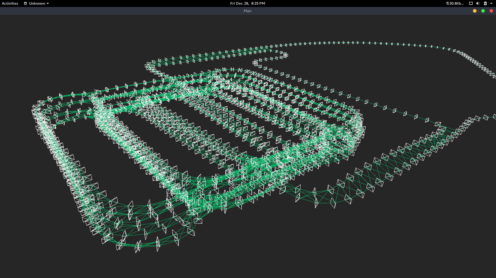

g2o-experiments
---
no clue what im doing, just trying to figure out how g2o works




videos
---
[sphere demo](https://www.youtube.com/watch?v=UOb5a2DydmI&index=4&list=PLz9N52s5FSIUFNoLjyNy_9EW42Ngy6ipn)

[garage demo](https://www.youtube.com/watch?v=E0D91GAmARQ&index=3&list=PLz9N52s5FSIUFNoLjyNy_9EW42Ngy6ipn)

how to use
---
```python posegraph.py optional/your/dataset/here.g2o```
 - ```r``` - runs a single iteration of the optimizer
 - ```t``` - toggle before/after

[notes](notes.md)
---

TODO
---
 - start working on optimization
 - add settings to viewer (before/after)

dependencies
---
 - numpy
 - [pangolin (python bindings)](https://github.com/uoip/pangolin)
 - [g2opy](https://github.com/uoip/g2opy)
 - python 2.7


license
---
my code's MIT licensed, but please attribute my work if you found it useful.
 - g2o/g2opy, BSD Licensed
 - [citations for dataset](data/dataset.md)

 [uoip](https://github.com/uoip) is a real G.
